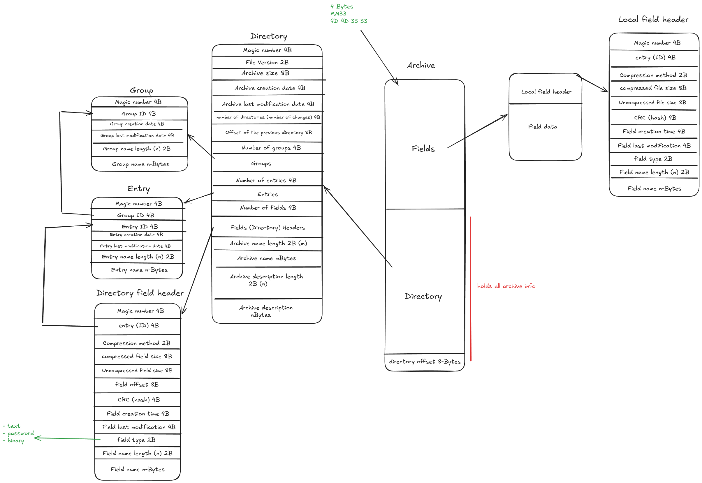

# Cryptos

**Authors:** Mohannad El-Shahiedy & Mohamed Ali

A hierarchical binary archive and credential manager written in C.

---

## Overview

**Cryptos** is a custom binary file format and interactive CLI utility designed to store structured data like credentials, notes, and keys. Instead of storing data as a flat list, Cryptos organizes everything into a hierarchical structure: **Archive $\rightarrow$ Groups $\rightarrow$ Entries $\rightarrow$ Fields**.

The project implements its own binary serialization, memory management structures (dynamic vector and binary search tree), an append-only file layout, and AES-256-GCM encryption using OpenSSL.

---

## Key Features

* **Hierarchical Storage**: Organizes data logically into Groups, Entries, and Fields.
* **Trailing Directory**: Data is appended to the file, and a directory index is written at the end. This allows fast lookups without scanning the entire file.
* **Revision History**: Updating data appends a new directory snapshot while keeping older ones linked, allowing rollbacks to previous states.
* **Cross-Platform Endianness**: Writes data in little-endian order to ensure files work across different CPU architectures.
* **AES-256-GCM Encryption**: Encrypts sensitive fields with authenticated encryption (GCM) using OpenSSL to protect against tampering.
* **Search Index**: Uses an in-memory Binary Search Tree (BST) to quickly search through group, entry, and field names.
* **Interactive CLI**: A terminal interface that lets you navigate between archives, groups, and entries (similar to tools like `diskpart`).

---

## Data Structure

```
[ Archive: Vault ]
  │
  ├── [ Group: Personal ]
  │     │
  │     ├── [ Entry: GitHub ]
  │     │     ├── Field: Username (Text)
  │     │     └── Field: Token    (Password)
  │     │
  │     └── [ Entry: Email ]
  │           └── Field: Password (Password)
  │
  └── [ Group: Work ]
        └── ...
```

* **Archive**: The root file containing global metadata.
* **Group**: A category (e.g., "Personal", "Work").
* **Entry**: A specific account or item (e.g., "GitHub", "Server").
* **Field**: An individual data value (e.g., username, password, token).

---

## File Layout

The binary file uses an append-only layout:

```
+-----------------------------------------------------------+
| Magic Number (4 bytes: "MM33")                            |
+-----------------------------------------------------------+
| Data Area (Payloads and local headers)                    |
|  - Field 1 data                                           |
|  - Field 2 data                                           |
+-----------------------------------------------------------+
| Directory (Snapshot index)                                |
|  - Header & previous directory offset (for history)       |
|  - Groups list                                            |
|  - Entries list                                           |
|  - Fields list with exact file offsets                    |
+-----------------------------------------------------------+
| Last 8 Bytes: File offset pointing to active directory   |
+-----------------------------------------------------------+
```

When Cryptos opens an archive:
1. It reads the last 8 bytes of the file to find the directory offset.
2. It jumps directly to the directory and loads the structure into memory.
3. It only reads field data from disk when needed.

File Format Diagram:


---

## Project Structure

```
cryptos/
├── src/
│   ├── archive.c          # Core archive and hierarchy operations
│   ├── archive.h          # Data definitions (Archive, Group, Entry, Field)
│   ├── archive-cli.c      # Interactive command-line interface
│   ├── Bin_IO.c           # Binary reading/writing functions (little-endian)
│   ├── Bin_IO.h           
│   ├── bst.c              # Binary Search Tree implementation for search
│   ├── bst.h              
│   ├── vector.c           # Dynamic array implementation
│   ├── vector.h           
│   ├── error.c            # Error messages and utility helpers
│   └── error.h            
├── crypto/
│   ├── aes_gcm.c          # AES-256-GCM encryption/decryption
│   └── aes_gcm.h          
├── CMakeLists.txt         # Build configuration
└── README.md
```

---

## Building the Project

### Requirements
* C compiler supporting **C99** (GCC or Clang)
* **OpenSSL** development libraries (`libssl-dev`)
* **CMake** (version 3.15 or newer) or Make

### Linux (Ubuntu / Debian)

```bash
sudo apt update
sudo apt install build-essential cmake libssl-dev

git clone https://github.com/your-username/cryptos.git
cd cryptos

mkdir build && cd build
cmake ..
make
```

### Windows (MSYS2 / MinGW-w64)

```bash
# In MSYS2 terminal:
pacman -S mingw-w64-x86_64-gcc mingw-w64-x86_64-cmake mingw-w64-x86_64-openssl

mkdir build && cd build
cmake -G "MinGW Makefiles" ..
mingw32-make
```

---

## How to Use

Run the CLI by passing an archive file name:

```bash
./cryptos my_archive.db
```

### Basic Commands

| Command | Action |
| :--- | :--- |
| `list groups` | Show all groups in the archive |
| `add group <name>` | Create a new group |
| `select <number>` | Step inside a group, entry, or field |
| `add entry <name>` | Create an entry inside the selected group |
| `add field <name> <text\|password>` | Add a field to the selected entry |
| `set-content <text>` | Set or update the content of a selected field |
| `show` | Display the field content |
| `back` | Return to the parent context |
| `search <term>` | Search for names or text across the archive |
| `save` | Write changes to disk |
| `quit` | Exit the CLI |

### Example CLI Walkthrough

```text
vault > add group Personal
Group 'Personal' created.

vault > select 1
Switched to context: GROUP Personal

GROUP Personal > add entry GitHub
Entry 'GitHub' created.

GROUP Personal > select 1
Switched to context: ENTRY GitHub

ENTRY GitHub > add field Token password
Field 'Token' created.

ENTRY GitHub > select 1
Switched to context: FIELD Token

FIELD Token > set-content my_secret_token_123
Content updated.

FIELD Token > show
[Field: Token] Content: my_secret_token_123

FIELD Token > back
ENTRY GitHub > back
GROUP Personal > back

vault > save
Archive saved successfully.

vault > quit
```

---

## License

This project is licensed under the [MIT License](LICENSE).
