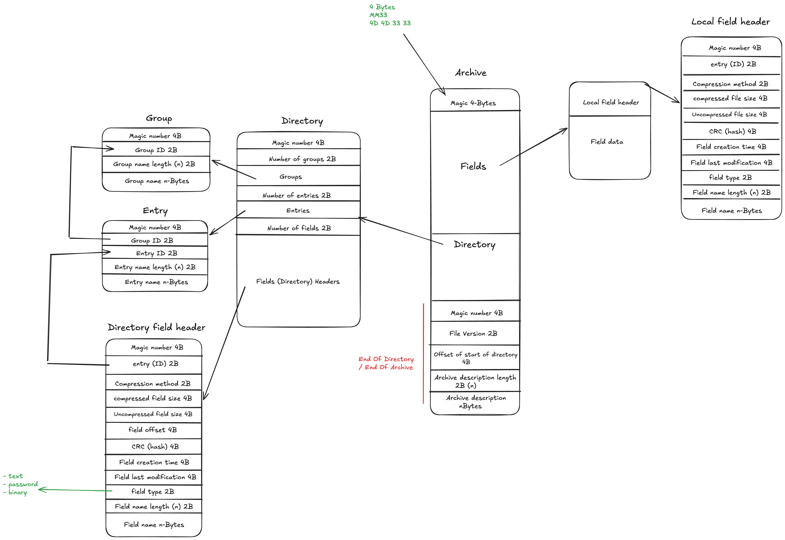

# Archive Format Specification

## Structure

### Layout

┌─────────────────────────┐
│       Field Data        │
│                         │
│   Local Field Header    │
│   Field Data            │
│                         │
│   Local Field Header    │
│   Field Data            │
│          ...            │
├─────────────────────────┤
│        Directory        │
│                         │
│  Groups                 │
│  Entries                │
│  Field Headers          │
├─────────────────────────┤
│     Archive Footer      │
└─────────────────────────┘

#### Archive Header
contains only magic number of 4 bytes.

↓

#### Fields
A field consists of 
    1- field local header 
    2- field data.

##### Local file header

| Offset | Size | Name                    | Description                                   |
| -----: | ---: | ----------------------- | --------------------------------------------- |
|      0 |    4 | Magic                   | Magic number identifying a local Field Header |
|      4 |    2 | Entry ID                | ID of the entry containing this field         |
|      6 |    2 | Compression Method      | Identifier of the compression algorithm       |
|      8 |    4 | Compressed Field Size   | Size of the compressed field data in bytes    |
|     12 |    4 | Uncompressed Field Size | Size of the original field data in bytes      |
|     16 |    4 | CRC                     | CRC/hash of the field data                    |
|     20 |    4 | Field Creation Time     | Creation timestamp                            |
|     24 |    4 | Field Last Modification | Last modification timestamp                   |
|     28 |    2 | Field Type              | Identifier describing the type of field       |
|     30 |    2 | Field Name Length       | Number of bytes in the field name             |
|     32 |    n | Field Name              | UTF-8 encoded field name                      |

↓

#### Directory
Directory contains fields headers(which contain their offsets in the file) and logical hierarchy (Groups and Entries) information.

| Offset | Size | Name              | Description                            |
| -----: | ---: | ----------------- | -------------------------------------- |
|      0 |    4 | Magic             | Magic number identifying the Directory |
|      4 |    2 | Number of Groups  | Number of groups in the directory      |
|      6 |    ? | Groups            | Group information                      |
|      ? |    2 | Number of Entries | Number of entries in the directory     |
|      ? |    ? | Entries           | Entry information                      |
|      ? |    2 | Number of Fields  | Number of fields in the directory      |
|      ? |    n | Field Headers     | Directory field headers                |

Groups and Entries sizes are defined in their blocks.

↓

#### Footer (EOD)
This is the end of archive or (End Of Directory), It contains archive info such as file version, directory offset and archive description

| Offset | Size | Name                       | Description                                       |
| -----: | ---: | -------------------------- | ------------------------------------------------- |
|      0 |    4 | Magic                      | ASCII `"MM33"` (`0x4D4D3333`)                     |
|      4 |    2 | File Version               | Version of the archive format                     |
|      6 |    4 | Directory Offset           | Absolute offset to the beginning of the directory |
|     10 |    2 | Archive Description Length | Number of bytes in the description                |
|     12 |    n | Archive Description        | UTF-8 encoded description                         |

`#TODO:` move to Archive header

### Blocks structure

#### Group

| Offset | Size | Name              | Description                                |
| -----: | ---: | ----------------- | ------------------------------------------ |
|      0 |    4 | Magic             | Magic number identifying a Group structure |
|      4 |    2 | Group ID          | Unique identifier of the group             |
|      6 |    2 | Group Name Length | Number of bytes in the group name          |
|      8 |    n | Group Name        | UTF-8 encoded group name                   |

#### Entry
| Offset | Size | Name              | Description                                 |
| -----: | ---: | ----------------- | ------------------------------------------- |
|      0 |    4 | Magic             | Magic number identifying an Entry structure |
|      4 |    2 | Group ID          | ID of the group containing this entry       |
|      6 |    2 | Entry ID          | Unique identifier of the entry              |
|      8 |    2 | Entry Name Length | Number of bytes in the entry name           |
|     10 |    n | Entry Name        | UTF-8 encoded entry name                    |

#### Field Directory Header
| Offset | Size | Name                    | Description                                       |
| -----: | ---: | ----------------------- | ------------------------------------------------- |
|      0 |    4 | Magic                   | Magic number identifying a directory Field Header |
|      4 |    2 | Entry ID                | ID of the entry containing this field             |
|      6 |    2 | Compression Method      | Identifier of the compression algorithm           |
|      8 |    4 | Compressed Field Size   | Size of the compressed field data in bytes        |
|     12 |    4 | Uncompressed Field Size | Size of the original field data in bytes          |
|     16 |    4 | Field Offset            | Absolute offset to the local field header/data    |
|     20 |    4 | CRC                     | CRC/hash of the field data                        |
|     24 |    4 | Field Creation Time     | Creation timestamp                                |
|     28 |    4 | Field Last Modification | Last modification timestamp                       |
|     32 |    2 | Field Type              | Identifier describing the type of field           |
|     34 |    2 | Field Name Length       | Number of bytes in the field name                 |
|     36 |    n | Field Name              | UTF-8 encoded field name                          |

    

## magic number

`0x4D4D3333` ("MM33")

## Endianness

All integers are saved in `Little Endian` format.

## Integer sizes

| Type   | Size    |
| ------ | ------- |
| uint16 | 2 bytes |
| uint32 | 4 bytes |
| uint64 | 8 bytes |

## Encoding

All Strings are encoded in `UTF-8`

## Version

Current version is: 0x0000

Readers should reject versions greater than the highest version they support.

## Compression methods

0x0000 = none
0x0001 = DEFLATE

## Field types

0x0000 = Binary
0x0001 = Text (UTF-8)
0x0002 = Password

